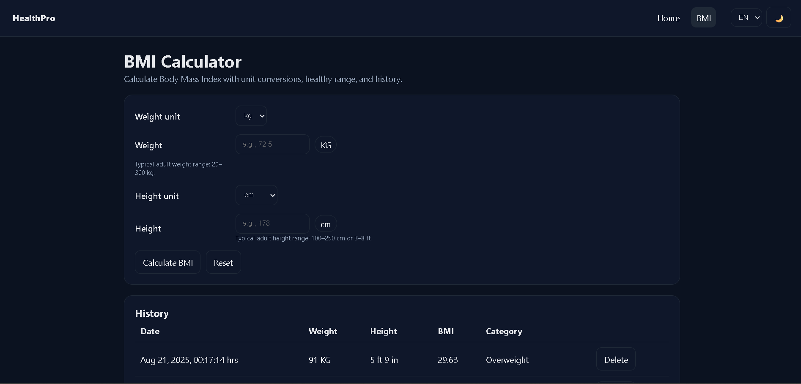
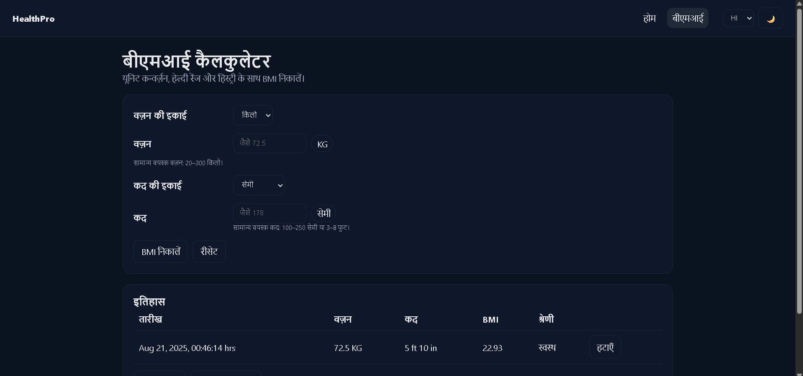

# BMI Calculator




-   **Live:** https://a2rp.github.io/bmi-calculator/
-   **Repo:** https://github.com/a2rp/bmi-calculator

Advanced BMI calculator built with React + styled-components.
Unit conversions (kg/lb, cm or ft+in), WHO categories (incl. Class I–III), healthy weight range in selected units, i18n (EN/HI), history with localStorage, and CSV export. Vite-powered & GH Pages–ready.

-   Language switcher (Tolgee v5)
-   Accessible form (labels, aria states, live results)
-   Local history (add/delete/clear, capped to last 20)
-   CSV export (clean, Excel/Sheets-friendly)
-   Router (BrowserRouter) with SPA fallback
-   All styles scoped via styled.js pattern (export const Styled = { Wrapper: styled.div`` })
-   Light/Dark via CSS variables (:root[data-theme]) — no Tailwind

## ✨ Features

-   Units:

    -   Weight: kg / lb
    -   Height: cm or ft + in (with inch clamped 0–11.9)

-   Validation & UX:

    -   Tight ranges: weight 20–300 kg, height 100–250 cm or 3–8 ft
    -   Clear error messaging + helper text
    -   Reset action

-   Results:

    -   BMI with two-decimal precision
    -   WHO categories: Underweight, Healthy, Overweight, Obesity (Class I/II/III)
    -   Healthy weight range for the given height in the selected weight unit

-   History & Export:

    -   Auto-saves each calculation (localStorage)
    -   Per-row delete + Clear all
    -   CSV export with headers

-   Internationalization (i18n):

    -   English 🇺🇸 / Hindi 🇮🇳 via Tolgee
    -   Language persisted; instant UI switch

-   Theming:

    -   Light/Dark toggle stored in localStorage
    -   Colors via CSS vars in index.css (--bg, --text, --card, …)

## 🧱 Tech Stack

-   React (Vite)
-   styled-components
-   react-router-dom (BrowserRouter)
-   @tolgee/react (i18n)
-   localStorage-backed “API” layer

## 🚀 Getting Started

```bash
# clone
git clone https://github.com/a2rp/bmi-calculator
cd bmi-calculator

# install
npm i

# dev
npm run dev

# build
npm run build

# preview production build
npm run preview
```
