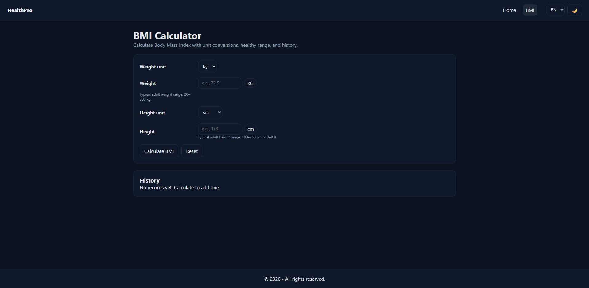

# BMI Calculator

A React and Vite BMI calculator with unit conversion, clear health categories, saved history, CSV export, and English/Hindi language support.



## Features

- kg/lb weight and cm/ft + in height units
- BMI result, category, and healthy weight range
- Input validation with accessible error messages
- Local calculation history with delete and clear actions
- CSV export
- Light/dark theme and English/Hindi switcher
- Lazy-loaded routes with a pathname-keyed loading state

## Run locally

```bash
npm install
npm run dev
```

Build with `npm run build` and deploy to GitHub Pages with `npm run deploy`.

## Links

- Live: https://a2rp.github.io/bmi-calculator/
- Repository: https://github.com/a2rp/bmi-calculator
- Portfolio: https://www.ashishranjan.net/
- GitHub: https://github.com/a2rp
- CodePen: https://codepen.io/ash1198
- LinkedIn: https://www.linkedin.com/in/aashishranjan
- Facebook: https://www.facebook.com/theash.ashish/
- YouTube: https://www.youtube.com/@ashishranjan-ashz?sub_confirmation=1
- Email: mailto:ash.ranjan09@gmail.com

## Support

- Support: https://a2rp-donation-page.netlify.app/
- Buy Me a Coffee: https://buymeacoffee.com/a2rp
- Patreon: https://www.patreon.com/a2rp
